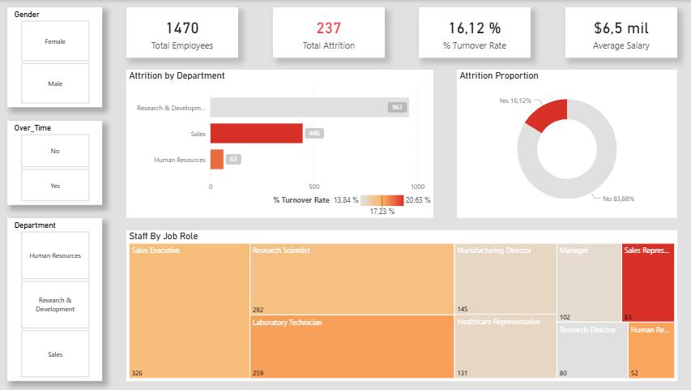
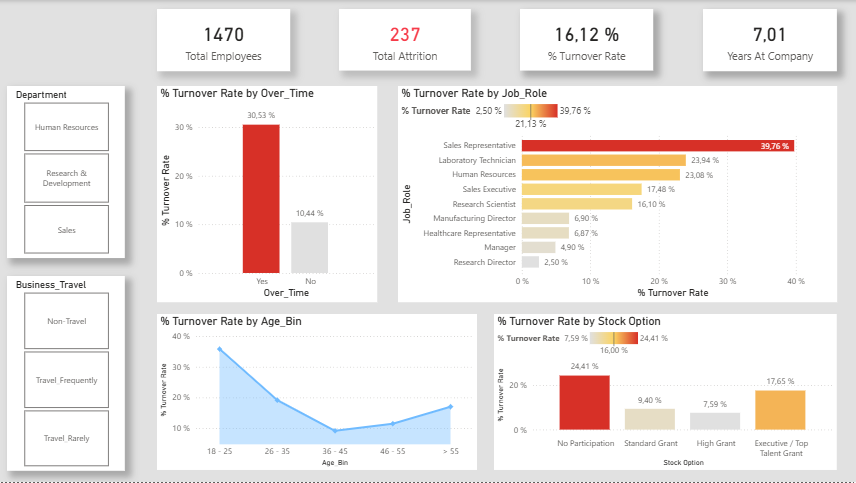

# Employee Attrition Analysis – Power BI

Proyecto de análisis de **rotación de empleados (attrition)** desarrollado en **Power BI**, con el objetivo de identificar patrones y factores asociados a la salida de empleados dentro de una organización.

El proyecto cubre todo el flujo de trabajo típico de un analista de Business Intelligence: preparación de datos, modelado dimensional, creación de métricas y diseño de dashboards orientados a la toma de decisiones.

---

## 🎯 Objetivo del proyecto

Analizar el attrition de empleados y responder a preguntas de negocio como:

- ¿Qué perfiles de empleados presentan mayor tasa de abandono?
- ¿Cómo influyen la satisfacción laboral y la antigüedad en la rotación?
- ¿Existen diferencias relevantes por departamento o rol?
- ¿Qué variables pueden ayudar a anticipar posibles salidas?

El objetivo no es solo visualizar datos, sino **aportar contexto analítico y facilitar la toma de decisiones en RRHH**.

---

## 📊 Dataset

- **Nombre**: HR Employee Attrition
- **Dominio**: Recursos Humanos
- **Granularidad**: 1 fila por empleado
- **Contenido principal**:
  - Datos demográficos
  - Información laboral
  - Métricas de satisfacción (escalas 1–4)
  - Desempeño y compensación
  - Indicador de attrition (Yes / No)

El dataset es **público**, se utiliza exclusivamente con fines educativos y de demostración, y fue recuperado de:

:link: https://www.kaggle.com/datasets/pavansubhasht/ibm-hr-analytics-attrition-dataset?utm_source=chatgpt.com

---

## 🧹 Preparación y transformación de datos (Power Query)

La preparación de los datos se realizó íntegramente en **Power Query (lenguaje M)**, aplicando buenas prácticas de BI:

- Corrección y estandarización de tipos de datos
- Eliminación de columnas irrelevantes
- Renombrado de campos para mejorar legibilidad y consistencia
- Creación de columnas derivadas:
  - Variables binarias (Attrition, Over Time)
  - Agrupaciones (*bins*) para edad, ingresos y antigüedad
  - Traducción de escalas numéricas (1–4) a descripciones textuales
- Centralización de transformaciones repetitivas para mejorar mantenibilidad

Las transformaciones se realizan en Power Query para mantener el modelo semántico limpio y reducir la complejidad en DAX.

:clipboard: Puede encontrarse un archivo con el contenido completo de las transformaciones en lenguaje M en "src/transformaciones.m".

---

## ⭐ Modelo de datos

El modelo se diseñó siguiendo un **esquema en estrella**, con el objetivo de mejorar la legibilidad, escalabilidad y claridad analítica.

### Tablas del modelo:

- **Fact_Attrition**  
- **Dim_Employee** (demografía)
- **Dim_JobDetails** (situación laboral)
- **Dim_Satisfaction** (encuestas y percepción)
- **Dim_PerformancePay** (desempeño y compensación)
- **Dim_Tenure** (antigüedad y ciclo de vida)

Las relaciones se establecen mediante la clave `EmployeeID`, con cardinalidad *one-to-one* (una fila, un empleado) desde la tabla de hechos hacia las dimensiones y dirección de filtro doble.

📸 

---

## 📐 Métricas y DAX

Se definieron medidas DAX orientadas a métricas clave de negocio, como:

- Total de empleados
- Empleados con attrition
- Tasa de attrition
- Análisis segmentado por departamento, rol, satisfacción y antigüedad

Ejemplo de medida:

```DAX
% Turnover Rate = DIVIDE([Total Attrition], [Total Employees], 0)
```

---

## 📈 Dashboard y visualización

El dashboard está diseñado para facilitar el análisis exploratorio y responder preguntas de negocio de forma intuitiva:

* KPIs principales de attrition

* Segmentadores por dimensiones clave

* Visualizaciones enfocadas en:

    * Satisfacción laboral

    * Antigüedad

    * Departamento y rol

    * Compensación y desempeño

📸 

📸 

---

## 🧠 Principales insights (ejemplo)

* La tasa de attrition es mayor en empleados con menor satisfacción laboral.

* Los empleados con baja antigüedad presentan mayor probabilidad de abandono.

* El overtime y determinados roles muestran una correlación clara con la rotación.

Estos resultados pueden servir como punto de partida para acciones de retención y mejora del clima laboral.

---

## 🛠️ Tecnologías utilizadas

* Power BI Desktop

* Power Query (lenguaje M)

* DAX

---

## ⚙️ Configuración del archivo .pbix

El archivo .pbix utiliza un parámetro llamado DataPath para definir la ruta local al dataset.

Para ejecutar el proyecto tras clonar el repositorio:

1. Abrir el archivo .pbix

2. Ir a Transformar datos → Administrar parámetros

3. Modificar el valor del parámetro DataPath para que apunte a la carpeta data/

Ejemplo: 

```txt
C:\ruta\al\repositorio\data\
```

--- 

## 📌 Qué demuestra este proyecto

* Capacidad para preparar y transformar datos reales

* Comprensión de modelado dimensional y esquemas en estrella

* Uso adecuado de DAX para métricas de negocio

* Diseño de dashboards orientados a análisis y toma de decisiones

* Enfoque profesional y estructurado de un proyecto BI completo

---

## 📄 Documentación adicional

En la carpeta /docs se incluye una memoria en PDF donde se documenta el proceso completo del proyecto, las decisiones de diseño y la evolución del análisis.

---

## 👤 Información Personal

* **Nombre:** Diego Alarcón Rodríguez
* **Rol:** Computer Engineer & Data Analyst
* **LinkedIn:** https://www.linkedin.com/in/diego-alarcon-rodriguez/
* **Portfolio:** https://github.com/dalarconro

---

Proyecto desarrollado con fines formativos y de portfolio.

---

> *Nota: actualmente el contenido de este repositorio se encuentra en español, pero estoy trabajando en su traducción completa al inglés. ¡Gracias por su comprensión!*

> *Note: This repository is currently Spanish, but I am working in its fully translation to English. Thank you for your understanding!*
